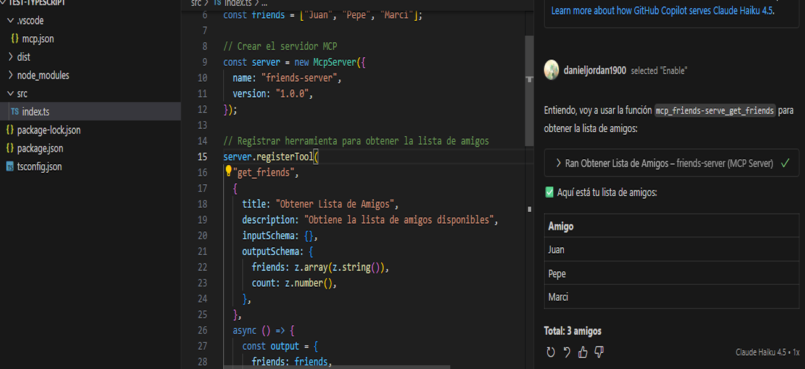

# MCP DevTest

Repositorio de pruebas y experimentación con **Model Context Protocol (MCP)**. Contiene múltiples miniproyectos para explorar diferentes implementaciones de servidores y clientes MCP.

## 📋 Proyectos

### test-typescript
Servidor MCP básico implementado en TypeScript que expone herramientas para gestionar una lista de amigos.



#### Tecnologías utilizadas:
- **TypeScript 5.3+**: Lenguaje tipado para mejor mantenibilidad
- **Model Context Protocol SDK**: SDK oficial de MCP para Node.js
- **Zod**: Librería de validación y esquemas TypeScript-first
- **Node.js 18+**: Runtime de JavaScript del lado del servidor
- **Stdio Transport**: Comunicación mediante entrada/salida estándar

#### Estructura:
```
test-typescript/
├── src/
│   └── index.ts          # Servidor MCP con herramienta get_friends
├── dist/                 # Código compilado
├── package.json          # Dependencias y scripts
├── tsconfig.json         # Configuración de TypeScript
└── .gitignore            # Archivos ignorados por Git
```

#### Características:
- Servidor MCP que gestiona una lista de amigos
- Herramienta `get_friends` para obtener la lista completa
- Validación de esquemas con Zod
- Manejo de errores robusto

#### Ejecución:
```bash
cd test-typescript
npm install
npm run dev      # Modo desarrollo
npm run build    # Compilar TypeScript
npm start        # Ejecutar servidor compilado
```

## 📦 Stack General

- **Patrón**: Model Context Protocol
- **Comunicación**: Stdio (estándar input/output)
- **Lenguajes**: TypeScript, JavaScript

## 🚀 Próximos Proyectos

- [ ] Cliente MCP en TypeScript
- [ ] Servidor con endpoints HTTP
- [ ] Integración con bases de datos
- [ ] Ejemplos en otros lenguajes

## 📝 Notas

Este repositorio es un sandbox para experimentar con las capacidades de MCP antes de implementarlas en proyectos de producción.

No olvide configurar el .vscode en cada proyecto "@ubicacion_directorio/test-typescript/.vscode":
```bash
{
  "servers": {
    "friends-server": {
      "command": "node",
      "args": ["@ubicacion_directorio\\test-typescript\\dist\\index.js"]
    }
  }
}
```

## 📄 Licencia

MIT